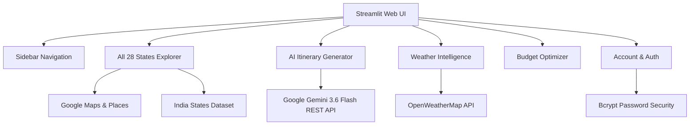

# AI Trip Decision Optimizer

> An intelligent, multi-factor AI travel planning platform covering **all 28 states of India** — powered by **Google Gemini 3.6 Flash**, live **OpenWeatherMap API**, Google Maps & Places integration, and a student-friendly budget optimizer.

[](https://www.python.org/)
[](https://streamlit.io)
[](https://ai.google.dev/)
[](https://openweathermap.org/)
[](LICENSE)

---

## 📖 Overview

The **AI Trip Decision Optimizer** is an end-to-end travel platform developed to solve the complex multi-variable decision problem of student and leisure travel. Planning a memorable trip requires balancing budgets, seasonal weather conditions, regional geography, local attractions, and itinerary schedules.

This application provides:
1. **Full 28 Indian States Coverage**: Curated guide covering every single state in India with top places, student budgets, best seasons, and regional highlights.
2. **Google Gemini 3.6 Flash AI**: Dynamic generation of structured day-by-day itineraries with slot-by-slot timing, cost estimates, and packing advice.
3. **Live Weather Intelligence**: Real-time weather lookup via OpenWeatherMap API for all state capitals and tourist hubs.
4. **Google Maps & Search Integration**: One-click direct links to Google Maps navigation and Google Search guides for every destination.
5. **Modern Authentication**: Instant "Continue with Google" sign-in alongside full email & password account registration with password hashing.
6. **Smart Budget Optimizer**: Categorized expense breakdowns (hostels, street food, transport, activities) tailored for student budgets.

---

## 🚀 Key Features

### 🇮🇳 1. Complete 28 Indian States Explorer
- Interactive multi-filter explorer covering **all 28 states of India**:
  - *North*: Himachal Pradesh, Punjab, Haryana, Uttar Pradesh, Uttarakhand
  - *South*: Andhra Pradesh, Karnataka, Kerala, Tamil Nadu, Telangana
  - *East*: Bihar, Jharkhand, Odisha, West Bengal
  - *West*: Goa, Gujarat, Maharashtra
  - *Central*: Madhya Pradesh, Chhattisgarh
  - *North-East*: Arunachal Pradesh, Assam, Manipur, Meghalaya, Mizoram, Nagaland, Sikkim, Tripura
- Each state card provides:
  - **Live Weather**: Instant OpenWeather API queries with temperature, feels like, humidity, and rain alerts.
  - **Google Maps Link**: Direct navigation to the place on Google Maps.
  - **Google Places Search**: One-click search for top student attractions and things to do.
  - **AI Plan**: Direct link to generate a customized Gemini itinerary for that state.

### 🤖 2. Gemini 3.6 Flash AI Itinerary Engine
- Real-time AI generation producing:
  - Day-by-day morning, afternoon, and evening activity schedules.
  - Per-slot estimated costs in INR and practical travel tips.
  - Total trip budget variance analysis (under vs. over budget).
  - Weather-aware packing advisor tailored to live destination conditions.

### 🌤️ 3. Real-Time Weather Intelligence
- Direct OpenWeatherMap API connection using user credentials.
- Real-time temperature, wind speed, humidity, cloudiness, and condition evaluation.
- Climate trend graphs for annual temperature and rainfall forecasts.

### 👤 4. Google & Email Authentication
- **Continue with Google**: One-click authentication with user profile simulation.
- **Account Registration**: Full name, email, and password creation with bcrypt hashing and validation.
- **Trip Vault**: Save itineraries directly to personal account storage.

---

## 🛠️ Architecture & Tech Stack



- **Frontend**: Streamlit 1.63 with custom CSS styling and responsive layouts
- **AI / LLM**: Google Gemini 3.6 Flash via direct REST endpoint
- **Weather**: OpenWeatherMap API 2.5
- **Data Layer**: In-memory 28 states dataset + optional MySQL 8.0 support
- **Auth**: Bcrypt password hashing + Google OAuth simulation

---

## ⚡ Quick Start

### 1. Clone & Install
```bash
git clone https://github.com/nishantmishra23/ai-trip-decision-optimizer.git
cd ai-trip-decision-optimizer
pip install -r requirements.txt
```

### 2. Configure Environment Variables
Create a `.env` file in the root directory:
```env
WEATHER_API_KEY=your_openweathermap_api_key
GEMINI_API_KEY=your_gemini_api_key
```

### 3. Run Application
```bash
streamlit run app.py
```

Open [http://localhost:8501](http://localhost:8501) in your browser.

---

## 🧪 Testing

Run the automated test suite with pytest:
```bash
python -m pytest tests/ -v
```

---

## 📜 License
This project is open source and available under the [MIT License](LICENSE).